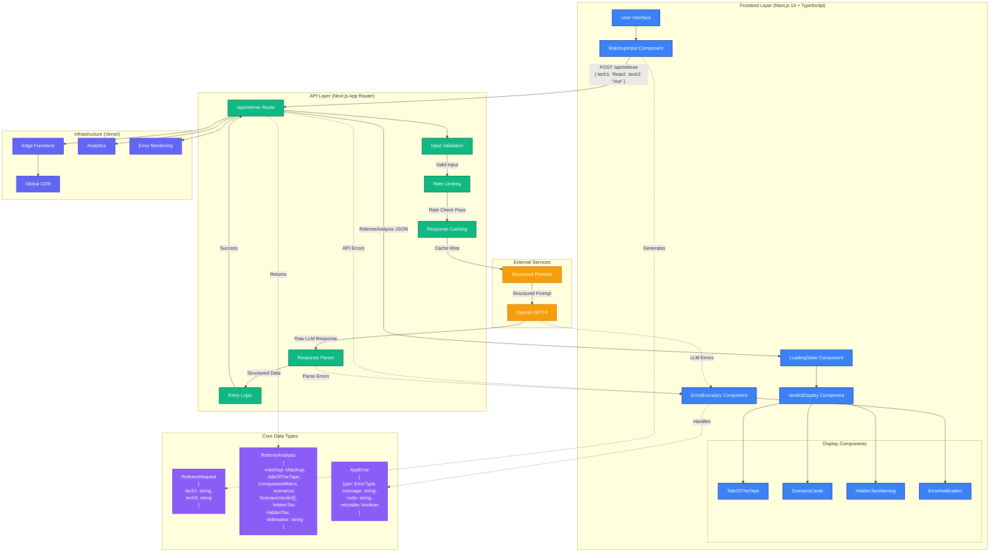

# Tech Referee System Architecture

## Overview

The Tech Referee is a full-stack web application built with Next.js 14, TypeScript, and OpenAI integration. This document provides a comprehensive overview of the system architecture, data flow, and key design decisions.

## System Architecture Diagram



## Layer-by-Layer Architecture

### 1. Frontend Layer (Client-Side)

#### Core Components
- **MatchupInput**: Handles user input with validation and normalization
- **LoadingState**: Provides engaging loading experience with progressive messages
- **VerdictDisplay**: Orchestrates the display of analysis results
- **ErrorBoundary**: Catches and handles React errors gracefully

#### Display Components
- **TaleOfTheTape**: Renders comparison matrix with responsive design
- **ScenarioCards**: Shows context-aware verdicts for different team types
- **HiddenTaxWarning**: Highlights potential downsides and future costs
- **ErrorNotification**: Provides user-friendly error messages with retry options

#### Key Features
```typescript
// Technology normalization with alias support
const normalizeTechnologyName = (tech: string): string => {
  const aliases: Record<string, string> = {
    'reactjs': 'React',
    'react.js': 'React',
    'postgresql': 'PostgreSQL',
    'postgres': 'PostgreSQL',
    // ... more aliases
  };
  
  const normalized = tech.toLowerCase().trim();
  return aliases[normalized] || tech.trim();
};

// Enhanced error handling with retry capability
const handleSubmit = async (tech1: string, tech2: string) => {
  try {
    const result = await makeApiCall(tech1, tech2);
    setAnalysis(result);
  } catch (err) {
    if (err instanceof AppError && err.retryable) {
      setError(err);
    }
  }
};
```

### 2. API Layer (Server-Side)

#### Request Processing Pipeline
1. **Input Validation**: Validates request structure and required fields
2. **Rate Limiting**: Prevents abuse with configurable limits
3. **Caching**: Reduces LLM calls for repeated requests
4. **Prompt Generation**: Creates structured prompts for consistent responses
5. **Response Parsing**: Converts unstructured LLM output to typed data

#### Implementation Details
```typescript
// API route with comprehensive error handling
export async function POST(request: NextRequest): Promise<NextResponse<RefereeResponse>> {
  try {
    // 1. Parse and validate request
    const body = await parseRequestBody(request);
    if (!body.success) {
      return createErrorResponse(body.error.code, body.error.message, 400);
    }

    // 2. Rate limiting
    const clientId = request.headers.get('x-forwarded-for') || 'unknown';
    if (!checkRateLimit(clientId)) {
      return createErrorResponse('RATE_LIMIT_EXCEEDED', 'Too many requests', 429);
    }

    // 3. Generate structured prompt
    const promptPackage = createPromptPackage(body.data.tech1, body.data.tech2);
    
    // 4. Call OpenAI with timeout
    const llmResponse = await Promise.race([
      callOpenAI(promptPackage.userPrompt),
      new Promise<never>((_, reject) => 
        setTimeout(() => reject(new Error('Request timeout')), 30000)
      )
    ]);

    // 5. Parse and validate response
    const analysis = await parseLLMResponse(llmResponse, body.data.tech1, body.data.tech2);
    
    return NextResponse.json({ success: true, data: analysis.data });
    
  } catch (error) {
    return handleApiError(error);
  }
}
```

### 3. LLM Integration Layer

#### Structured Prompt Engineering
```typescript
// Prompt template ensures consistent, parseable responses
export function createPromptPackage(tech1: string, tech2: string): PromptPackage {
  const systemPrompt = `You are "The Tech Referee," a senior solutions architect and impartial arbiter. 
  Your goal is to facilitate decision-making by providing objective technology comparisons.
  
  Core Philosophy: "There is no best tool, only the best tool for the specific job."
  
  Always:
  1. Reject absolutes - never say "X is better than Y" without context
  2. Expose hidden costs - maintenance burden, learning curve, scaling challenges
  3. Provide scenario-based recommendations for different team contexts`;

  const userPrompt = `Compare ${tech1} vs ${tech2} using this EXACT structure:

### 1. 🥊 The Matchup
[Brief definition of contenders and core conflict - 2-3 sentences max]

### 2. 📊 The Tale of the Tape
| Dimension | ${tech1} | ${tech2} |
|-----------|----------|----------|
| Speed | [specific descriptor] | [specific descriptor] |
| Cost | [specific descriptor] | [specific descriptor] |
| Developer Experience | [specific descriptor] | [specific descriptor] |
| Scalability | [specific descriptor] | [specific descriptor] |
| Maintainability | [specific descriptor] | [specific descriptor] |

### 3. ⚖️ The Verdicts
**Scenario A (The 'Move Fast' Team):** Which wins? Why?
**Scenario B (The 'Scale' Team):** Which wins? Why?
**Scenario C (The 'Budget' Team):** Which wins? Why?

### 4. ⚠️ The "Hidden Tax"
If you choose [Option], be prepared to pay the tax of [Specific Downside] in [Timeframe].

### 5. 🏁 The Tie-Breaker
[Single cutting question that forces decision]

CRITICAL: Use specific descriptors, not generic terms like "Good/Bad". 
Examples: "$0 start cost", "High learning curve", "Complex deployment"`;

  return {
    systemPrompt,
    userPrompt,
    isValid: validatePromptInputs(tech1, tech2),
    errors: []
  };
}
```

#### Response Parsing with Fallback Patterns
```typescript
// Multi-pattern parsing handles LLM response variations
function parseTaleOfTheTape(content: string, tech1: string, tech2: string) {
  const patterns = [
    // Pattern 1: Standard markdown table
    /\|[^|]*\|[^|]*\|[^|]*\|/g,
    
    // Pattern 2: Colon-separated format
    /Speed\s*[:|]\s*([^|\n]+?)\s*\|\s*([^|\n]+?)(?=\n|$)/i,
    
    // Pattern 3: Flexible line-based matching
    /Speed[^\n]*?([A-Za-z0-9$][^|\n]*?)\s*[|\s]+([A-Za-z0-9$][^|\n]*?)(?=\n|$)/i,
    
    // Pattern 4: Bold markdown format
    /\*\*Speed\*\*\s*\|\s*([^|]+?)\s*\|\s*([^|]+?)(?=\n|$)/i
  ];
  
  for (let i = 0; i < patterns.length; i++) {
    const match = content.match(patterns[i]);
    if (match && match[1] && match[2]) {
      return {
        success: true,
        data: {
          tech1: match[1].trim().replace(/^\*\*|\*\*$/g, ''),
          tech2: match[2].trim().replace(/^\*\*|\*\*$/g, '')
        }
      };
    }
  }
  
  return {
    success: false,
    error: `No matching pattern found for Speed dimension`
  };
}
```

### 4. Infrastructure Layer (Vercel)

#### Deployment Configuration
```javascript
// next.config.js
/** @type {import('next').NextConfig} */
const nextConfig = {
  experimental: {
    appDir: true,
  },
  env: {
    OPENAI_API_KEY: process.env.OPENAI_API_KEY,
  },
  headers: async () => [
    {
      source: '/api/:path*',
      headers: [
        { key: 'Access-Control-Allow-Origin', value: '*' },
        { key: 'Access-Control-Allow-Methods', value: 'GET, POST, OPTIONS' },
        { key: 'Access-Control-Allow-Headers', value: 'Content-Type' },
      ],
    },
  ],
};

module.exports = nextConfig;
```

#### Performance Optimizations
- **Edge Functions**: Global distribution for low latency
- **Automatic Code Splitting**: Component-level optimization
- **Image Optimization**: Next.js Image component with lazy loading
- **Bundle Analysis**: Webpack bundle analyzer integration

## Data Models

### Core Types
```typescript
// Request/Response Types
interface RefereeRequest {
  tech1: string;
  tech2: string;
}

interface RefereeResponse {
  success: boolean;
  data?: RefereeAnalysis;
  error?: ApiError;
}

// Analysis Structure
interface RefereeAnalysis {
  matchup: {
    technology1: string;
    technology2: string;
  };
  taleOfTheTape: ComparisonMatrix;
  scenarios: ScenarioVerdict[];
  hiddenTax: HiddenTax;
  tieBreaker: string;
}

// Comparison Matrix
interface ComparisonMatrix {
  speed: { tech1: string; tech2: string };
  cost: { tech1: string; tech2: string };
  developerExperience: { tech1: string; tech2: string };
  scalability: { tech1: string; tech2: string };
  maintainability: { tech1: string; tech2: string };
}

// Scenario Verdicts
interface ScenarioVerdict {
  name: 'Move Fast Team' | 'Scale Team' | 'Budget Team';
  winner: string;
  reasoning: string;
  context: string;
}

// Hidden Tax Warning
interface HiddenTax {
  technology: string;
  warning: string;
  timeframe: string;
  impact: string;
}

// Error Handling
interface AppError {
  type: ErrorType;
  message: string;
  code: string;
  originalError?: any;
  timestamp: Date;
  retryable: boolean;
}

enum ErrorType {
  VALIDATION_ERROR = 'VALIDATION_ERROR',
  NETWORK_ERROR = 'NETWORK_ERROR',
  API_ERROR = 'API_ERROR',
  PARSING_ERROR = 'PARSING_ERROR',
  RATE_LIMIT_ERROR = 'RATE_LIMIT_ERROR',
  UNKNOWN_ERROR = 'UNKNOWN_ERROR'
}
```

## Security Considerations

### API Security
```typescript
// Rate limiting implementation
const rateLimitMap = new Map<string, { count: number; resetTime: number }>();
const RATE_LIMIT_WINDOW = 60000; // 1 minute
const RATE_LIMIT_MAX_REQUESTS = 10;

function checkRateLimit(clientId: string): boolean {
  const now = Date.now();
  const clientData = rateLimitMap.get(clientId);
  
  if (!clientData || now > clientData.resetTime) {
    rateLimitMap.set(clientId, { count: 1, resetTime: now + RATE_LIMIT_WINDOW });
    return true;
  }
  
  if (clientData.count >= RATE_LIMIT_MAX_REQUESTS) {
    return false;
  }
  
  clientData.count++;
  return true;
}

// Input sanitization
function sanitizeInput(input: string): string {
  return input
    .trim()
    .replace(/[<>]/g, '') // Remove potential HTML tags
    .substring(0, 100); // Limit length
}
```

### Environment Variables
```bash
# .env.local (not committed to version control)
OPENAI_API_KEY=sk-...
NODE_ENV=production
NEXT_PUBLIC_APP_URL=https://your-domain.com
```

## Performance Metrics

### Target Performance
- **Time to First Byte (TTFB)**: < 200ms
- **First Contentful Paint (FCP)**: < 1.5s
- **Largest Contentful Paint (LCP)**: < 2.5s
- **Cumulative Layout Shift (CLS)**: < 0.1
- **First Input Delay (FID)**: < 100ms

### Monitoring Implementation
```typescript
// Performance monitoring
export async function POST(request: NextRequest) {
  const startTime = Date.now();
  
  try {
    // ... API logic
    
    const duration = Date.now() - startTime;
    console.log(`Successful analysis generated in ${duration}ms`);
    
    // Log performance metrics
    if (process.env.NODE_ENV === 'production') {
      // Send to analytics service
      analytics.track('api_request_success', {
        duration,
        tech1: body.data.tech1,
        tech2: body.data.tech2
      });
    }
    
  } catch (error) {
    const duration = Date.now() - startTime;
    console.error(`API route error after ${duration}ms:`, error);
    
    // Track errors
    if (process.env.NODE_ENV === 'production') {
      analytics.track('api_request_error', {
        duration,
        error: error.message,
        stack: error.stack
      });
    }
  }
}
```

## Scalability Considerations

### Horizontal Scaling
- **Stateless Design**: No server-side session storage
- **Edge Functions**: Automatic global distribution
- **Database-Free**: No persistent storage requirements
- **Caching Strategy**: In-memory caching with TTL

### Vertical Scaling
- **Memory Management**: Efficient parsing and garbage collection
- **Connection Pooling**: OpenAI API connection reuse
- **Request Batching**: Future enhancement for bulk comparisons

### Cost Optimization
```typescript
// Cost-aware LLM usage
const COST_PER_TOKEN = 0.00003; // GPT-4 pricing
const MAX_TOKENS_PER_REQUEST = 4000;

function estimateRequestCost(prompt: string): number {
  const estimatedTokens = prompt.length / 4; // Rough estimation
  return estimatedTokens * COST_PER_TOKEN;
}

// Cache expensive operations
const responseCache = new Map<string, { data: RefereeAnalysis; timestamp: number }>();
const CACHE_TTL = 24 * 60 * 60 * 1000; // 24 hours

function getCachedResponse(tech1: string, tech2: string): RefereeAnalysis | null {
  const key = `${tech1.toLowerCase()}-${tech2.toLowerCase()}`;
  const cached = responseCache.get(key);
  
  if (cached && Date.now() - cached.timestamp < CACHE_TTL) {
    return cached.data;
  }
  
  return null;
}
```

## Testing Strategy

### Test Coverage
- **Unit Tests**: Individual component and function testing
- **Integration Tests**: API endpoint and data flow testing
- **Property-Based Tests**: Edge case discovery with Fast-check
- **End-to-End Tests**: Complete user journey validation

### Test Implementation
```typescript
// Property-based test example
import fc from 'fast-check';

describe('Input Validation Properties', () => {
  it('should consistently validate technology inputs', () => {
    fc.assert(fc.property(
      fc.string({ minLength: 1, maxLength: 50 }),
      fc.string({ minLength: 1, maxLength: 50 }),
      (tech1, tech2) => {
        const result = validateInputs(tech1, tech2);
        
        // Properties that should always hold
        expect(typeof result.isValid).toBe('boolean');
        expect(Array.isArray(result.errors)).toBe(true);
        
        if (!result.isValid) {
          expect(result.errors.length).toBeGreaterThan(0);
        }
      }
    ));
  });
});
```

## Future Architecture Enhancements

### Planned Improvements
1. **Redis Caching**: Distributed caching for better performance
2. **Database Integration**: User preferences and comparison history
3. **Microservices**: Separate services for different comparison types
4. **GraphQL API**: More flexible data fetching
5. **WebSocket Support**: Real-time collaboration features

### Migration Strategy
```typescript
// Future database schema (Prisma)
model Comparison {
  id          String   @id @default(cuid())
  tech1       String
  tech2       String
  analysis    Json
  createdAt   DateTime @default(now())
  userId      String?
  
  @@unique([tech1, tech2])
  @@map("comparisons")
}

model User {
  id          String   @id @default(cuid())
  email       String   @unique
  preferences Json?
  createdAt   DateTime @default(now())
  
  @@map("users")
}
```

This architecture provides a solid foundation for the current application while allowing for future enhancements and scaling requirements.