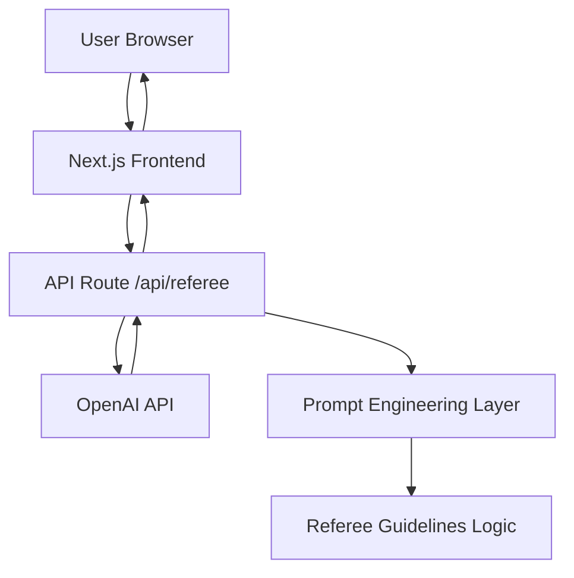

# Design Document: Tech Referee

## Overview

The Tech Referee is a Next.js 14 web application that provides objective technology comparisons through an intelligent decision-support interface. The system leverages OpenAI's API to generate structured analyses following the "Tech Referee" methodology, presenting trade-offs, scenarios, and hidden costs in a developer-focused UI.

The application follows a client-server architecture where the frontend handles user interactions and displays results, while server-side API routes manage LLM integration and prompt engineering. The design prioritizes speed, clarity, and actionable insights over comprehensive feature sets.

## Architecture

### High-Level Architecture



### Technology Stack

- **Framework**: Next.js 14 with App Router and TypeScript
- **Styling**: Tailwind CSS with dark theme configuration
- **Icons**: Lucide React for consistent iconography
- **LLM Integration**: OpenAI SDK for GPT-4 API calls
- **Deployment**: Vercel (optimized for Next.js)

### Project Structure

```
tech-referee/
├── app/
│   ├── layout.tsx              # Root layout with dark theme
│   ├── page.tsx                # Landing page with matchup input
│   ├── globals.css             # Tailwind imports and custom styles
│   └── api/
│       └── referee/
│           └── route.ts        # Server-side LLM integration
├── components/
│   ├── MatchupInput.tsx        # Technology input form
│   ├── VerdictDisplay.tsx      # Results presentation
│   ├── TaleOfTheTape.tsx       # Comparison table
│   ├── ScenarioCards.tsx       # Three scenario verdicts
│   ├── HiddenTaxWarning.tsx    # Prominent warning component
│   └── LoadingState.tsx        # Engaging loading animation
├── lib/
│   ├── openai.ts              # OpenAI client configuration
│   ├── prompts.ts             # Referee prompt templates
│   └── types.ts               # TypeScript interfaces
├── public/
│   └── favicon.ico
└── tailwind.config.js         # Dark theme configuration
```

## Components and Interfaces

### Core Components

#### MatchupInput Component
- **Purpose**: Captures user input for technology comparison
- **Props**: `onSubmit: (tech1: string, tech2: string) => void`
- **Features**: Input validation, auto-suggestions, submit handling
- **Styling**: Prominent placement, clear call-to-action

#### VerdictDisplay Component
- **Purpose**: Orchestrates the display of complete analysis results
- **Props**: `analysis: RefereeAnalysis`
- **Children**: TaleOfTheTape, ScenarioCards, HiddenTaxWarning
- **Layout**: Scannable hierarchy with clear information flow

#### TaleOfTheTape Component
- **Purpose**: Renders structured comparison table
- **Props**: `comparison: ComparisonMatrix`
- **Features**: Responsive table, specific descriptors, visual emphasis
- **Styling**: High contrast, developer tool aesthetic

#### ScenarioCards Component
- **Purpose**: Displays three scenario-based verdicts
- **Props**: `scenarios: ScenarioVerdict[]`
- **Features**: Interactive cards, clear winners, reasoning display
- **Layout**: Grid layout with equal emphasis on all scenarios

#### HiddenTaxWarning Component
- **Purpose**: Prominently displays potential downsides
- **Props**: `warning: HiddenTax`
- **Features**: Visual distinction, actionable warnings, time-bound alerts
- **Styling**: Warning colors (yellow/red borders), prominent positioning

#### LoadingState Component
- **Purpose**: Engaging loading experience during analysis
- **Features**: Progressive messages, anticipation building, smooth animations
- **Messages**: "Analyzing constraints...", "Calculating hidden taxes...", "Generating verdicts..."

### Data Models

#### RefereeAnalysis Interface
```typescript
interface RefereeAnalysis {
  matchup: {
    technology1: string;
    technology2: string;
  };
  taleOfTheTape: ComparisonMatrix;
  scenarios: ScenarioVerdict[];
  hiddenTax: HiddenTax;
  tieBreaker: string;
}
```

#### ComparisonMatrix Interface
```typescript
interface ComparisonMatrix {
  speed: {
    tech1: string;
    tech2: string;
  };
  cost: {
    tech1: string;
    tech2: string;
  };
  developerExperience: {
    tech1: string;
    tech2: string;
  };
  scalability: {
    tech1: string;
    tech2: string;
  };
  maintainability: {
    tech1: string;
    tech2: string;
  };
}
```

#### ScenarioVerdict Interface
```typescript
interface ScenarioVerdict {
  name: 'Move Fast Team' | 'Scale Team' | 'Budget Team';
  winner: string;
  reasoning: string;
  context: string;
}
```

#### HiddenTax Interface
```typescript
interface HiddenTax {
  technology: string;
  warning: string;
  timeframe: string;
  impact: string;
}
```

### API Design

#### POST /api/referee
- **Purpose**: Processes technology matchup requests
- **Input**: `{ tech1: string, tech2: string }`
- **Output**: `RefereeAnalysis`
- **Error Handling**: Graceful degradation with user-friendly messages
- **Rate Limiting**: Basic protection against abuse

## Correctness Properties

*A property is a characteristic or behavior that should hold true across all valid executions of a system—essentially, a formal statement about what the system should do. Properties serve as the bridge between human-readable specifications and machine-verifiable correctness guarantees.*

Based on the prework analysis, I've identified several properties that can be tested to ensure system correctness. After reviewing for redundancy, the following properties provide comprehensive coverage:

### Property Reflection

Several properties identified in the prework can be consolidated:
- Properties 4.3 and 4.4 both test hidden tax content quality and can be combined
- Properties 5.1 and 5.4 both test prompt format compliance and can be combined  
- Properties 1.2 and 1.4 both test input validation and can be combined

### Core Properties

**Property 1: Input validation consistency**
*For any* pair of technology inputs, if either input is empty or invalid, the system should prevent submission and display validation feedback
**Validates: Requirements 1.2, 1.4**

**Property 2: Valid submission processing**
*For any* valid technology matchup pair, submitting the form should initiate the comparison process and display loading states
**Validates: Requirements 1.3, 6.3**

**Property 3: Technology name normalization**
*For any* equivalent technology names or common aliases, the system should produce consistent comparison results
**Validates: Requirements 1.5**

**Property 4: Complete comparison structure**
*For any* valid comparison request, the generated analysis should contain all required fields: Speed, Cost, Developer Experience, Scalability, and Maintainability
**Validates: Requirements 2.1**

**Property 5: Specific descriptor usage**
*For any* generated comparison, the output should not contain generic terms like "Good", "Bad", "Better", or "Worse" without specific context
**Validates: Requirements 2.2**

**Property 6: Structured format compliance**
*For any* analysis output, the response should follow the referee guidelines structure with Matchup, Tale of the Tape, Verdicts, Hidden Tax, and Tie-Breaker sections
**Validates: Requirements 2.3**

**Property 7: Qualified statements only**
*For any* generated comparison text, absolute statements should be accompanied by qualifying conditions (if/when/unless clauses)
**Validates: Requirements 2.5**

**Property 8: Three scenario completeness**
*For any* verdict output, exactly three scenarios should be present with names "Move Fast Team", "Scale Team", and "Budget Team"
**Validates: Requirements 3.1**

**Property 9: Scenario reasoning inclusion**
*For any* scenario verdict, the output should include specific reasoning text explaining why the chosen technology wins in that context
**Validates: Requirements 3.2**

**Property 10: Simultaneous scenario display**
*For any* analysis result, all three scenarios should be displayed together to enable easy comparison
**Validates: Requirements 3.5**

**Property 11: Hidden tax presence**
*For any* completed analysis, a specific Hidden Tax warning should be included that identifies potential downsides
**Validates: Requirements 4.1**

**Property 12: Time-bound hidden tax warnings**
*For any* Hidden Tax warning, the text should contain specific timeframes and actionable impact descriptions
**Validates: Requirements 4.3, 4.4**

**Property 13: Structured prompt generation**
*For any* matchup submission, the API call to the LLM service should include a prompt that follows the exact referee guidelines format
**Validates: Requirements 5.1, 5.4**

**Property 14: API error handling**
*For any* LLM service failure or invalid response, the system should return appropriate error messages and maintain system stability
**Validates: Requirements 5.2, 5.5**

**Property 15: Response validation**
*For any* LLM response received, the system should validate that it contains the required structured data before presenting to users
**Validates: Requirements 5.3**

**Property 16: Tie-breaker inclusion**
*For any* completed analysis, exactly one tie-breaker question should be included as the final element
**Validates: Requirements 7.1**

<function_calls>
<invoke name="prework">
<parameter name="featureName">tech-referee

## Error Handling

### Client-Side Error Handling
- **Input Validation**: Real-time validation with clear error messages
- **Network Failures**: Graceful degradation with retry options
- **Loading States**: Timeout handling for long-running requests
- **User Feedback**: Clear error messages in user-friendly language

### Server-Side Error Handling
- **API Rate Limits**: Respect OpenAI API limits with exponential backoff
- **Invalid Responses**: Validate LLM responses before returning to client
- **Malformed Requests**: Proper HTTP status codes and error messages
- **Service Unavailability**: Fallback responses when external services fail

### Error Recovery Patterns
- **Retry Logic**: Automatic retry for transient failures
- **Fallback Content**: Default responses when LLM is unavailable
- **User Guidance**: Clear instructions for resolving common issues
- **Logging**: Comprehensive error logging for debugging

## Testing Strategy

### Dual Testing Approach
The application will use both unit testing and property-based testing to ensure comprehensive coverage:

- **Unit Tests**: Verify specific examples, edge cases, and error conditions
- **Property Tests**: Verify universal properties across all inputs
- Both approaches are complementary and necessary for complete validation

### Unit Testing Focus Areas
- Component rendering with specific props
- API route error handling with known failure cases
- Input validation with edge cases (empty strings, special characters)
- LLM response parsing with malformed data
- UI interaction flows with specific user actions

### Property-Based Testing Configuration
- **Framework**: Fast-check for TypeScript property-based testing
- **Iterations**: Minimum 100 iterations per property test
- **Test Tagging**: Each property test references its design document property
- **Tag Format**: `// Feature: tech-referee, Property {number}: {property_text}`

### Property Test Implementation
Each correctness property will be implemented as a separate property-based test:

1. **Property 1-3**: Input validation and processing properties
2. **Property 4-7**: Output structure and content validation properties  
3. **Property 8-12**: Scenario and warning completeness properties
4. **Property 13-16**: API integration and response validation properties

### Testing Tools and Setup
- **Jest**: Primary testing framework for unit tests
- **React Testing Library**: Component testing utilities
- **Fast-check**: Property-based testing library
- **MSW (Mock Service Worker)**: API mocking for reliable tests
- **Test Coverage**: Minimum 80% code coverage requirement

### Integration Testing
- **API Route Testing**: End-to-end API functionality
- **Component Integration**: Multi-component interaction testing
- **Error Boundary Testing**: Error handling across component boundaries
- **Performance Testing**: Response time validation for user experience